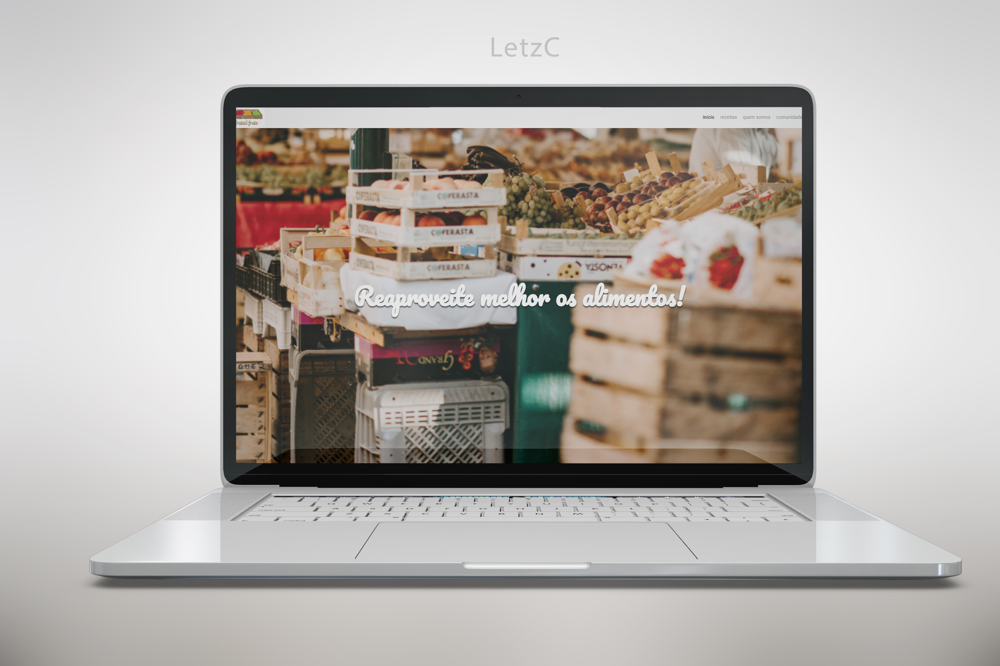

# Alura Arquitetura Css
Site criado para a empresa Fruta & Fruto, com o objetivo de divulgar receitas. 
  

Protótipo: https://www.figma.com/file/0gMF5BPgplPYqQA6Om1T1sk9/alura-bootstrap?node-id=0%3A1

##  :mag_right: Como acessar:
Para acessar [clique aqui!](https://letzc.github.io/Arquitetura-CSS/#)

## 📦 Tecnologias usadas:
- 
- 

## :memo: Sobre o projeto:
- Projeto guiado da Alura.

## :file_folder: Autores:
- Desenvolvedora: [LetzC](https://github.com/LetzC)
- Crédito a base do Mockup para a capa do projeto: Image by zlatko_plamenov on Freepik
